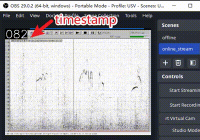

# Time stamp watermark
---
A minimal time stamp watermark for testing video streaming latency. The watermark is 120x60 in size.


```
Source_PC [virtual_cam.py -> WATERMARK]  ==>> Video RTSP ==> Observer [cvdecoder.py]
    \\                                                           |
     \\          <<<RTSP STREAMING LATENTCY>>>                   |
      \\                                                         |
       -- timecode now------------------------------------------> Observer [netdecoder.py]
```

## 1. Installation
Install in Source_PC [Windows Only]
```
pip install pyvirtualcam opencv-python tqdm numpy
```

Install in Observer [Windows or Linux]
```
# pytorch with cuda support
# tensorrt
# opencv-python, numpy
pip install git+https://github.com/chenxinfeng4/torch2trt
pip install ffmpegcv

# neuron network to decode the cv timestamp
trtexec --onnx=shufflenet_120_norm.onnx --fp16 --saveEngine=shufflenet_120_norm.engine
```

## 2. Run Source_PC
```
# start virtual camera
python virtual_cam.py

# start streaming
Use the OBS to capture the virtual camera and stream it to the RTSP server
```

## 3. Run Observer
```
# open and edit the address in the file
python observer_test_latency.py
```
